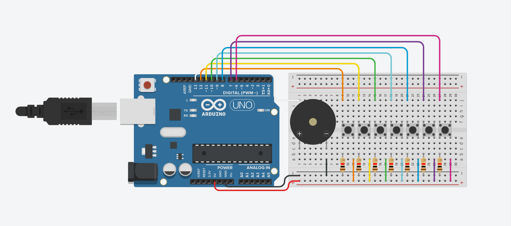

# Buzzer Piano

It simulates the seven basic keys of a piano octave (C, D, E, F, G, A, B) with their respective approximate frequency values.

### [Tinker this](https://www.tinkercad.com/things/aZ0lNs219rd)