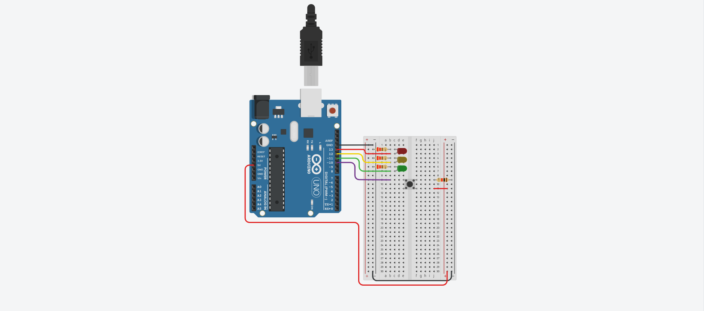

# Traffic Lights

It simulates traffic lights behavior using LEDs in their respective colors.

> ## Version A
>
> It shows a brief LED animation.
>
> ## Version B
>
> It turns on the next LED by pressing the push button.

### [Tinker this](https://www.tinkercad.com/things/4uTFgT4hKn4)